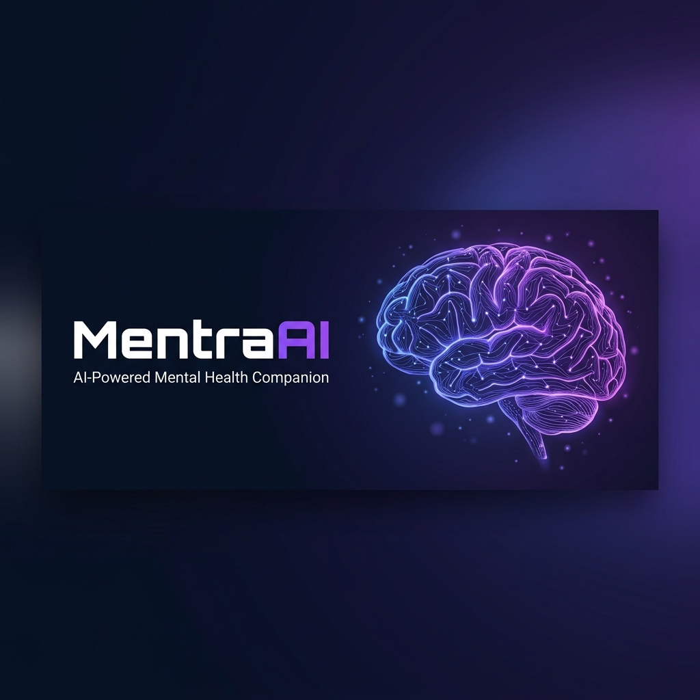
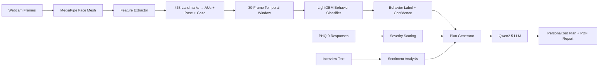

<p align="center">
  
</p>

<h1 align="center">🧠 MentraAI</h1>

<p align="center">
  <strong>AI-Powered Mental Health Companion — Private, Real-Time, Personalized</strong>
</p>

<p align="center">
  
  
  
  
  
  
</p>

<p align="center">
  <a href="#-features">Features</a> •
  <a href="#-architecture">Architecture</a> •
  <a href="#-tech-stack">Tech Stack</a> •
  <a href="#-getting-started">Getting Started</a> •
  <a href="#-usage-guide">Usage Guide</a> •
  <a href="#-cv-pipeline-deep-dive">CV Pipeline</a> •
  <a href="#-screenshots">Screenshots</a> •
  <a href="#-contributing">Contributing</a>
</p>

---

## 📖 Overview

**MentraAI** is a privacy-first, multimodal mental health assistant that combines **real-time computer vision**, a **clinically-validated questionnaire (PHQ-9)**, an **AI-guided therapeutic interview**, and a **locally-running large language model** to deliver personalized mental health assessments and coping plans — all without sending a single byte of your data to the cloud.

> **⚠️ Disclaimer:** MentraAI is an AI screening tool and is **not a substitute** for professional clinical diagnosis or treatment. If you are in crisis, please contact a mental health professional or a crisis helpline immediately.

---

## ✨ Features

### 🎭 Real-Time Facial Behavior Analysis
- **468-point Face Mesh** tracking via MediaPipe with adaptive landmark detection
- **FACS Action Unit extraction** (AU1, AU2, AU4, AU5, AU6, AU9, AU12, AU15, AU20) — quantified and normalized
- **LightGBM behavioral classifier** trained on the [DAIC-WOZ depression corpus](https://dcapswoz.ict.usc.edu/) for clinical-grade behavior state prediction
- **10 behavioral states**: Engaged, Disengaged, Low Energy, Agitated, Tense, Overaroused, Withdrawn, Positive Engagement, Cognitive Load, Ambiguous
- **Stress scoring** with rolling-window smoothing and individualized calibration
- **Blink rate monitoring**, head pose tracking (pitch/yaw/roll), and facial landmark overlay toggle

### 📋 PHQ-9 Depression Screening
- Digitized, interactive version of the clinically-validated **Patient Health Questionnaire-9**
- Automatic severity scoring (Minimal → Mild → Moderate → Moderately Severe → Severe)
- Visual progress tracking with real-time score computation

### 💬 AI-Guided Therapeutic Interview
- **10-category structured interview** covering:

  | # | Category | Purpose |
  |---|----------|---------|
  | 1 | 🟢 Warm-Up | Baseline tone, emotional openness |
  | 2 | 🔵 Emotional Awareness | Emotional variability, vocabulary richness |
  | 3 | 🟡 Energy & Motivation | Fatigue, anhedonia detection |
  | 4 | 🟠 Thought Patterns | Rumination, anxiety markers |
  | 5 | 🔴 Stress & Triggers | Stress sources, trigger awareness |
  | 6 | 🟣 Social Connection | Isolation, perceived support |
  | 7 | ⚫ Self-Perception | Self-worth, internal dialogue |
  | 8 | 🟤 Coping Behavior | Healthy vs unhealthy coping |
  | 9 | ⚪ Future Outlook | Hopelessness (key depression marker) |
  | 10 | 🔺 Gentle Risk Check | Safe risk assessment with escalation logic |

- **Text input** with optional **voice input** (Web Speech API)
- Real-time **CV snapshot** captured alongside each response for behavioral correlation
- Keyboard shortcut support (`Ctrl+Enter` to submit)

### 🤖 AI-Powered Plan Generation
- **Local Qwen2.5-7B-Instruct** LLM (GGUF quantized) for fully offline AI reasoning
- Combines PHQ-9 scores + interview analysis + behavioral CV data into a unified clinical context
- Generates: personalized advice, coping strategies, daily reminders, and severity-appropriate crisis resources
- **Heuristic fallback** ensures plans are always generated even without the LLM

### 📄 Clinical PDF Report
- Premium-quality, multi-page clinical report with:
  - Cover page with patient info, PHQ-9 summary, and platform branding
  - Detailed patient profile and PHQ-9 breakdown with visual score bar
  - Behavioral & stress analysis from video session
  - AI-generated advice, coping steps, daily reminders
  - Interview analysis with engagement, sentiment, and risk indicators
  - Crisis resources localized for **India** (iCall, Vandrevala Foundation, NIMHANS)
  - Signature blocks for patient and reviewing clinician

### 🔒 Privacy-First Design
- **Zero cloud dependency** — all AI inference runs locally on your machine
- Video frames analyzed in real-time and **immediately discarded** (never stored)
- No external API calls for sensitive data processing
- In-memory data stores (no persistent database in development mode)

---

## 🏗 Architecture

```
┌──────────────────────────────────────────────────────────────────┐
│                        FRONTEND (Browser)                        │
│  ┌─────────┐  ┌──────────┐  ┌──────────┐  ┌──────┐  ┌────────┐ │
│  │  Login   │→ │ Profile  │→ │  PHQ-9   │→ │  CV  │→ │  Plan  │ │
│  │  Screen  │  │  Screen  │  │  Screen  │  │ + AI │  │ + Dash │ │
│  └─────────┘  └──────────┘  └──────────┘  │ Intv │  └────────┘ │
│                                            └──────┘             │
│  ┌──────────────────────────────────────────────────────────────┐│
│  │ particles.js  │  app.js (state mgmt)  │  styles.css (glass) ││
│  └──────────────────────────────────────────────────────────────┘│
└──────────────────────────┬───────────────────────────────────────┘
                           │ REST API (JSON)
┌──────────────────────────▼───────────────────────────────────────┐
│                       BACKEND (Flask)                             │
│                                                                   │
│  ┌──────────────┐  ┌────────────────┐  ┌──────────────────────┐  │
│  │  app.py       │  │ cv_pipeline.py │  │  llm_pipeline.py     │  │
│  │  ─────────── │  │  ────────────  │  │  ────────────────    │  │
│  │  Auth API     │  │  LandmarkTrack │  │  LLMEngine           │  │
│  │  Profile API  │  │  FeatureExtract│  │  (llama-cpp-python)  │  │
│  │  PHQ-9 API    │  │  EmotionDetect │  │                      │  │
│  │  Interview API│  │  StressAnalyzer│  │  Behavior prompts    │  │
│  │  Plan API     │  │  BehaviorClass │  │  JSON response parse │  │
│  │  Dashboard API│  │  (LightGBM)    │  │                      │  │
│  └──────────────┘  └────────────────┘  └──────────────────────┘  │
│                                                                   │
│  ┌────────────────────────────────┐  ┌─────────────────────────┐ │
│  │  behavior_model.pkl (LightGBM) │  │  Qwen2.5-7B (GGUF)     │ │
│  │  label_encoder.pkl             │  │  (in backend/models/)   │ │
│  └────────────────────────────────┘  └─────────────────────────┘ │
└──────────────────────────────────────────────────────────────────┘
```

### Data Flow



---

## 🛠 Tech Stack

| Layer | Technology | Purpose |
|:------|:-----------|:--------|
| **Frontend** | HTML5, CSS3 (Glassmorphism), Vanilla JS | SPA with particle canvas, glass-card UI, step wizard |
| **Backend** | Python 3.9+, Flask, Flask-CORS | RESTful API server serving frontend + processing |
| **Computer Vision** | MediaPipe Face Mesh, OpenCV | 468-point landmark tracking, frame preprocessing |
| **Behavior Model** | LightGBM (scikit-learn) | DAIC-WOZ trained temporal behavior classifier |
| **Feature Extraction** | Custom FACS AU math | Eye Aspect Ratio, Brow Raise/Furrow, Mouth AR, Head Pose |
| **LLM Inference** | llama-cpp-python, Qwen2.5-7B-Instruct (Q4_K_M GGUF) | Local text generation for advice & plan synthesis |
| **Speech-to-Text** | Web Speech API (browser-native) | Optional voice input during interviews |
| **Training Data** | [DAIC-WOZ Corpus](https://dcapswoz.ict.usc.edu/) | Clinical interview dataset for depression research |

---

## 🚀 Getting Started

### Prerequisites

| Requirement | Minimum | Recommended |
|:------------|:--------|:------------|
| **CPU** | Multi-core x86_64 / ARM64 | Intel i7 / Ryzen 7 / Apple M-series |
| **RAM** | 8 GB | 16 GB (for LLM inference) |
| **GPU** | Not required | NVIDIA w/ CUDA (accelerates LLM) |
| **Python** | 3.9+ | 3.11+ |
| **Webcam** | Any | 720p+ resolution |
| **Browser** | Chrome / Edge (for Web Speech API) | Latest Chrome |

### Installation

**1. Clone the repository**
```bash
git clone https://github.com/yourusername/MentraAI.git
cd MentraAI
```

**2. Create a virtual environment**
```bash
python -m venv .venv
source .venv/bin/activate        # Linux / macOS
# .venv\Scripts\activate         # Windows
```

**3. Install Python dependencies**
```bash
pip install -r backend/requirements.txt
pip install lightgbm scikit-learn flask-cors
```

**4. Download the LLM model**

Download the Qwen2.5-7B-Instruct GGUF model and place it in `backend/models/`:
```bash
mkdir -p backend/models
# Download from HuggingFace (≈ 4.4 GB)
wget -O backend/models/Qwen2.5-7B-Instruct-Q4_K_M.gguf \
  "https://huggingface.co/Qwen/Qwen2.5-7B-Instruct-GGUF/resolve/main/qwen2.5-7b-instruct-q4_k_m.gguf"
```

> **Note:** The app works without the LLM — it falls back to heuristic-based plan generation.

**5. (Optional) Train the behavior model**

If you have the DAIC-WOZ dataset, place the CLNF files in `backend/data/` and run:
```bash
python backend/train.py
```

A pre-trained `behavior_model.pkl` and `label_encoder.pkl` are already included.

**6. Start the server**
```bash
cd backend
python app.py
```

**7. Open in browser**
```
http://localhost:5000
```

Login with the demo credentials:
- **Email:** `demo@mentra.ai`
- **Password:** `demo123`

---

## 📱 Usage Guide

MentraAI follows a **5-step guided flow**:

### Step 1 — Sign In
Log in with your credentials or create a new account. Demo credentials are pre-filled for quick testing.

### Step 2 — Profile
Enter your personal details (name, age, occupation, hobbies). This context is used to personalize your wellness plan.

### Step 3 — PHQ-9 Assessment
Answer 9 clinically-validated questions about your mental health over the past 2 weeks. Each question has 4 response options scored 0–3.

### Step 4 — AI Interview + Video Analysis
- **Start the camera** for real-time facial behavior analysis
- **Start the interview** to begin the AI-guided 10-category session
- Type (or speak) your responses to each question
- Monitor your real-time behavioral indicators, stress level, and FACS Action Units in the sidebar
- Toggle the **face landmark overlay** to visualize tracking points

### Step 5 — Personalized Plan & Dashboard
- Click **"Generate Personal Plan"** to synthesize all data through the LLM
- Review your personalized advice, coping strategies, daily reminders, and crisis resources
- **Download as PDF** — a beautifully formatted clinical report
- View the **Dashboard** for a consolidated overview of all your session data

---

## 🔬 CV Pipeline Deep Dive

### Landmark Tracking
MentraAI uses MediaPipe's **468-point Face Mesh** with intelligent fallback:
- **CLAHE histogram equalization** for difficult lighting conditions
- **Automatic re-initialization** after consecutive detection failures
- Supports both legacy MediaPipe (≤0.9) and Tasks API (≥0.10)

### FACS Action Unit Extraction

All Action Units are normalized by a reference distance (inter-ocular distance) for scale invariance:

| Action Unit | Muscle | What It Detects |
|:------------|:-------|:----------------|
| **AU1** | Inner Brow Raiser | Sadness, Surprise |
| **AU2** | Outer Brow Raiser | Surprise |
| **AU4** | Brow Lowerer | Anger, Stress, Concentration |
| **AU5** | Upper Lid Raiser | Fear, Surprise |
| **AU6** | Cheek Raiser (Duchenne) | Genuine Smile |
| **AU9** | Nose Wrinkler | Disgust |
| **AU12** | Lip Corner Puller | Happiness |
| **AU15** | Lip Corner Depressor | Sadness |
| **AU20** | Lip Stretcher | Fear |

### Behavior Classification

The LightGBM model processes a **30-frame temporal window** with 4 statistical aggregations (mean, std, max, min) across 14 features = **56 input features** per prediction:

```
14 features × 4 aggregations = 56-dimensional feature vector per window
├── 9 Action Units (AU01–AU20)
├── 3 Head Pose angles (Pitch, Yaw, Roll)
└── 2 Gaze angles (X, Y)
```

### Adaptive Calibration

The emotion detection system performs a **60-frame calibration** period to establish individualized baselines. This means:
- ✅ Works accurately with **beards** and facial hair
- ✅ Adapts to different **camera distances** and angles
- ✅ Handles varying **lighting conditions**
- ✅ Accounts for natural **resting face differences**

### Stress Scoring

Stress is computed as a composite signal:
- **Eye Aspect Ratio** deviation from baseline
- **Movement jitter** (upper-face landmark drift)
- **Blink rate** anomalies (high → anxiety, low → dissociation)
- **Brow furrow** contraction ratio
- **Emotion modifier** from FACS detection
- Smoothed via a **60-frame rolling window** for stable readings

---

## 📂 Project Structure

```
MentraAI/
├── 📁 assets/
│   └── banner.png                 # Repository banner image
├── 📁 backend/
│   ├── app.py                     # Flask server, API routes, plan generation
│   ├── cv_pipeline.py             # Complete CV pipeline (1039 lines)
│   │   ├── LandmarkTracker        #   MediaPipe wrapper with fallback
│   │   ├── FeatureExtractor       #   FACS AU + EAR + MAR + Head Pose
│   │   ├── EmotionDetector        #   Calibrated multi-signal emotion fusion
│   │   ├── StressAnalyzer         #   Rolling-window stress scorer
│   │   ├── BehaviorClassifier     #   LightGBM temporal behavior model
│   │   └── CVPipeline             #   Orchestrator combining all above
│   ├── llm_pipeline.py            # LLM engine (llama-cpp-python wrapper)
│   ├── train.py                   # DAIC-WOZ training pipeline
│   ├── behavior_model.pkl         # Pre-trained LightGBM model (~10 MB)
│   ├── label_encoder.pkl          # Sklearn label encoder
│   ├── requirements.txt           # Python dependencies
│   └── 📁 models/                 # GGUF model files (gitignored)
├── 📁 frontend/
│   ├── index.html                 # Single-page application (746 lines)
│   ├── app.js                     # Frontend logic & state management (1625 lines)
│   ├── styles.css                 # Glassmorphism UI theme (38 KB)
│   └── particles.js               # Animated canvas background
├── 📁 daic-woz/                   # DAIC-WOZ dataset (gitignored)
├── .gitignore
├── PROJECT_REPORT.md
├── formal_report.md
└── README.md
```

---

## 🤝 Contributing

Contributions are welcome! Here's how you can help:

1. **Fork** the repository
2. **Create** a feature branch (`git checkout -b feature/amazing-feature`)
3. **Commit** your changes (`git commit -m 'Add amazing feature'`)
4. **Push** to the branch (`git push origin feature/amazing-feature`)
5. **Open** a Pull Request

### Areas for Contribution

- 🗄️ **Database integration** — Replace in-memory stores with PostgreSQL/SQLite
- 🎤 **Enhanced STT** — Reintegrate Faster-Whisper for offline voice transcription
- 📊 **Longitudinal tracking** — Multi-session progress charts and trend analysis
- 🌍 **i18n** — Multi-language support for interviews and UI
- 📱 **Mobile optimization** — Progressive Web App (PWA) capabilities
- 🧪 **Testing** — Unit tests for CV pipeline and API endpoints

---

## 📚 References

1. Gratch, J. et al. (2014). *The Distress Analysis Interview Corpus of Human and Computer Interviews* (DAIC-WOZ). [LREC'14](https://dcapswoz.ict.usc.edu/)
2. Google MediaPipe. *Face Mesh Solutions.* [Documentation](https://developers.google.com/mediapipe/solutions/vision/face_landmarker)
3. Ke, G. et al. (2017). *LightGBM: A Highly Efficient Gradient Boosting Decision Tree.* [NeurIPS 2017](https://github.com/microsoft/LightGBM)
4. Gerganov, G. (2023). *Llama.cpp: Port of Facebook's LLaMA model in C/C++.* [GitHub](https://github.com/ggerganov/llama.cpp)
5. Kroenke, K. et al. (2001). *The PHQ-9: Validity of a Brief Depression Severity Measure.* Journal of General Internal Medicine.
6. Ekman, P. & Friesen, W.V. (1978). *Facial Action Coding System (FACS).* Consulting Psychologists Press.

---

## 🆘 Crisis Resources (India)

If you or someone you know is in crisis, please reach out:

| Service | Contact | Hours |
|:--------|:--------|:------|
| **iCall — TISS** | 📞 9152987821 | Mon–Sat, 8 AM – 8 PM |
| **Vandrevala Foundation** | 📞 1860-2662-345 / 1800-2333-330 | 24/7, Free |
| **NIMHANS** | 📞 080-46110007 | Bangalore |
| **iMind — NICTS** | 📞 1-800-599-0019 | 24/7, Toll-free |

---

## 📜 License

This project is licensed under the **MIT License** — see the [LICENSE](LICENSE) file for details.

---

<p align="center">
  <strong>Built with 💜 for mental health awareness</strong>
  <br>
  <sub>MentraAI — Because your mental health matters.</sub>
</p>
